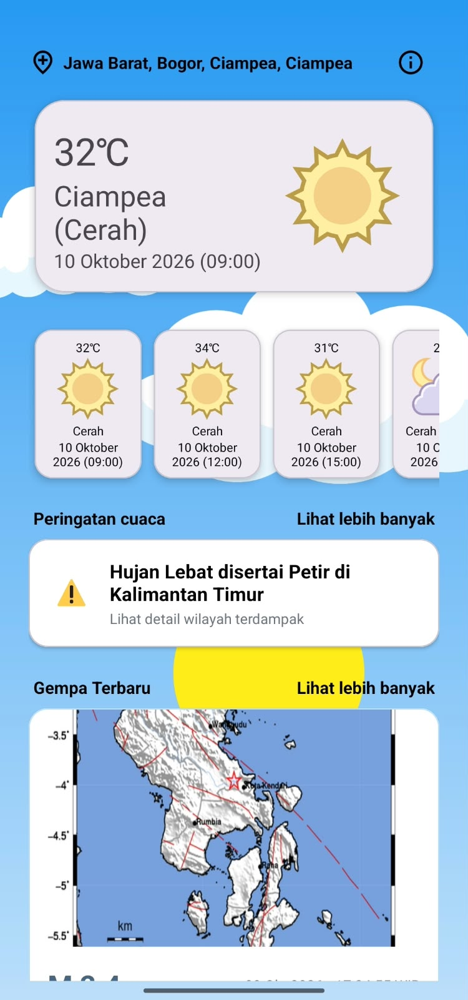
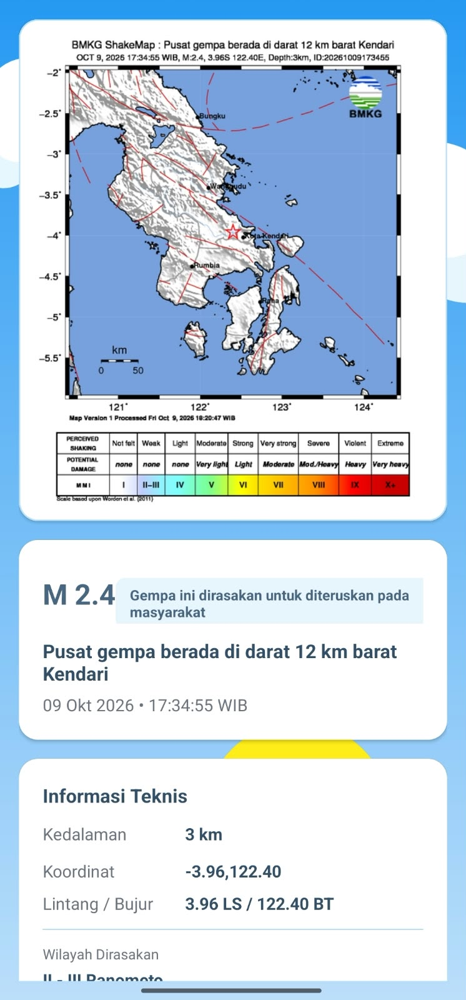

<div align="center">

# 🌧️ Perbana
**An Android Disaster Warning, Weather Forecast, and Earthquake Monitoring App Powered by BMKG Open Data.**

[](https://www.android.com)
[](https://www.oracle.com/java/)
[](https://developer.android.com/guide/topics/ui)
[](LICENSE)

</div>

---

## 📖 About The App
**Perbana** is a monitoring Android application designed to deliver public safety information, weather conditions, and disaster alerts across Indonesia. Focused on accessible public safety, Perbana directly integrates official data from the **BMKG Open Data API** and **Indonesia Administrative Region Codes** to provide precise updates down to regional levels.

---

## ✨ Key Features

- **🌤️ Weather Forecast:** Displays real-time and daily weather predictions based on specific regions in Indonesia.
- **🌋 Earthquake Alerts:** Live monitoring of recent earthquake events (M 5.0+, felt earthquakes, and potential tsunami warnings).
- **📳 Real-Time Earthquake Vibration Detection:** Uses the device's built-in accelerometer sensor to detect sudden physical tremors and local ground movement in real-time, providing immediate visual and audio alerts on the device.
- **⚠️ Weather Early Warning:** Real-time push alerts and early warnings for extreme weather events using Common Alerting Protocol (CAP) standards.

---

## 📱 Screenshots

|          Weather Forecast           |         Earthquake Information         |           Weather Early Warning           |
|:-----------------------------------:|:--------------------------------------:|:-----------------------------------------:|
|  |  |  |

---

## 🎥 Video Demo

[](https://youtu.be/D_E6x6vxcec)

---

## 📡 Data Sources & References

- **[BMKG Open Data API](https://data.bmkg.go.id/):** Official source for weather forecasts, earthquake logs, and early warnings.
- **[Indonesia Administrative Region Codes](https://github.com/cahyadsn/wilayah):** Reference database for Indonesian regional codes and administrative hierarchies.

---

## 🛠️ Tech Stack & Libraries

- **Language:** Java
- **UI & Layout:** XML Layouts and Lottie Animations
- **Networking:** `HttpURLConnection`, RESTful API Integration
- **Background Operations:** `ScheduledExecutorService`, `Executors`
- **System Integration:** `DownloadManager`, `BroadcastReceiver`, `FileProvider`

---

## 🚀 How to Run
1. **Clone this repository:**
   ```bash
   git clone https://github.com/username/Perbana.git
   ```
2. Open the project in Android Studio. 
3. Let Gradle sync dependencies. 
4. Run the app on an emulator or physical Android device.

---

## 📄 License
This project is licensed under the MIT License.